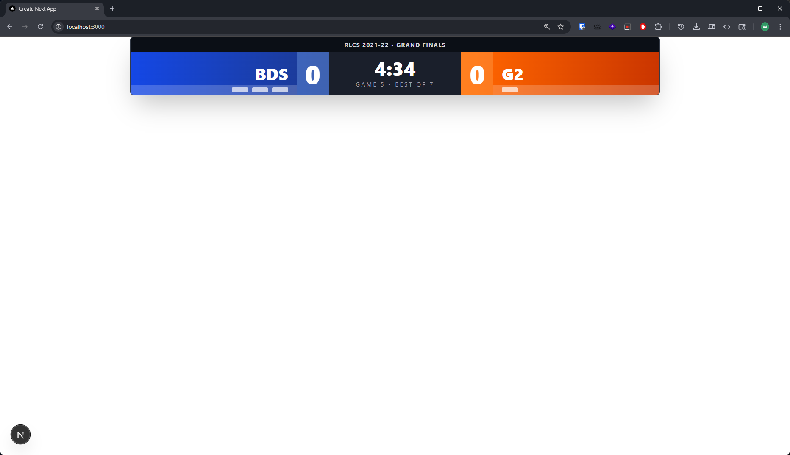
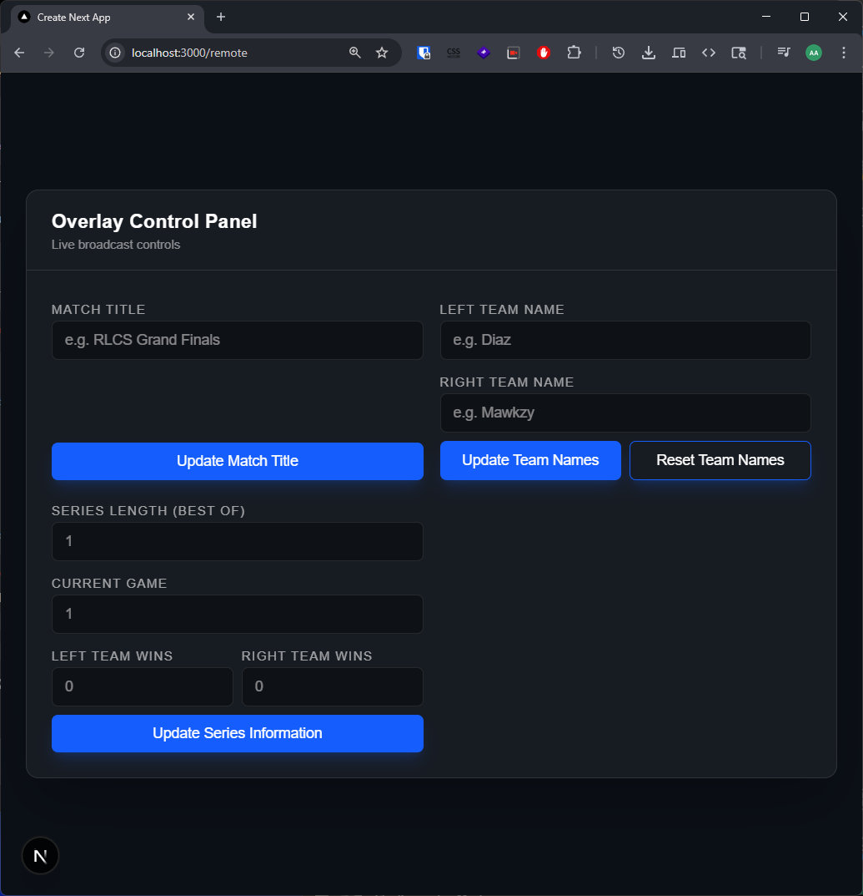

This is a [Next.js](https://nextjs.org) project bootstrapped with [`create-next-app`](https://nextjs.org/docs/app/api-reference/cli/create-next-app).

## Getting Started

Open Rocket League

Start the bridge server

```bash
npx rl-ts-bridge
```

Install the dependencies:

```bash
npm install
```

Then run the overlay controls websocket server:

```bash
npm run remote
```

Then run the development server:

```bash
npm run dev
```

The overlay will be hosted at http://localhost:3000



The overlay remote will be hosted at http://localhost:3000/remote

